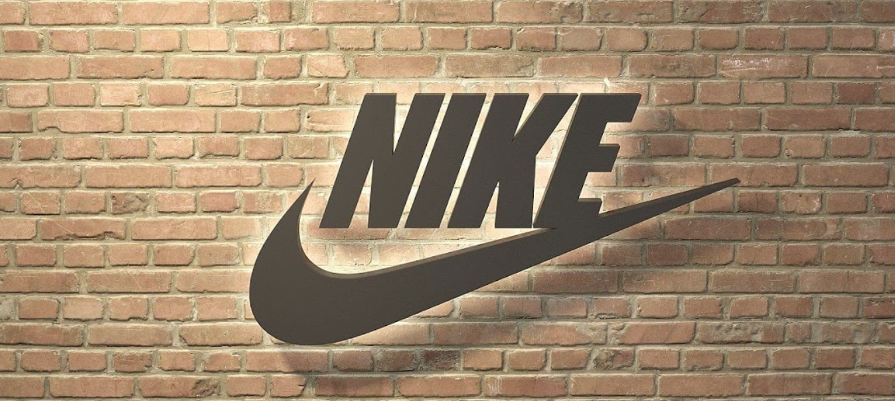
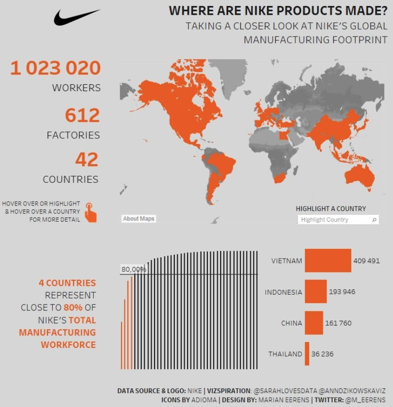
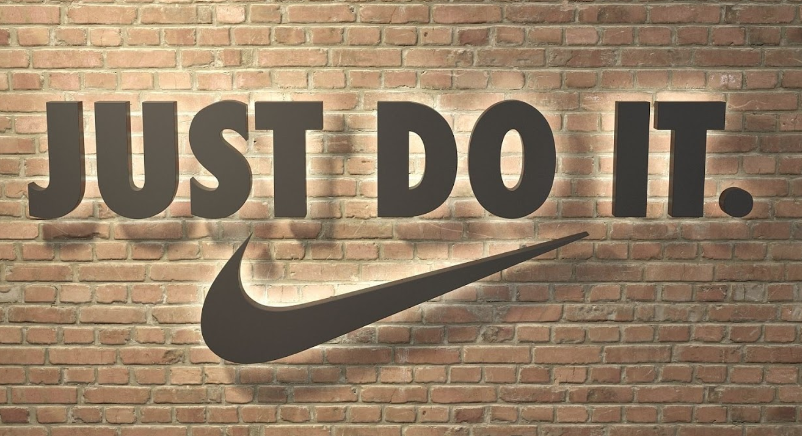

# Nike_project

# Group Members
Auchal Azad, Shandy Zhen Fung, Jingyu Ge, Ronas Khanal,
Chen Liu, Liza Muzashvili, Estefania Rodas, Seok-hyun Whang
# Overview
- Established in 1964 (Blue Ribbon Sports)
- Mission “To bring inspiration and innovation to every athlete in the world.”
# SEGMENT ANALYSIS
- Brand Equity - “Just Do It”
- Subsidiaries  - Cole Haan,  Converse,  Hurley,  Nike Golf,  Umbro

- Tailor-made products
# SUPPLY CHAIN MANAGEMENT
Manufacturer

- Headquarter
Only focus on core business,
outsourcing production.
- Outsourcing 
Cheap labor abroad.

# SUPPLY CHAIN MANAGEMENT
- Distributor

BOTTLENECK in the manufacturing segment of the supply chain. 

- Solution
Nike collaborated with Apollo Global Management LLC. to increase revenue and alleviate their bottleneck. 

-  Retailer
-- Local Retail and Clearance store
-- Official Website
-- Third-party licenses

- Reverse Logistics

-- Learn from the past
-- Find out the reason for common errors
-- Search for the solution and reduce risk
# QUALITY MANAGEMENT
- Nike actively uses the Internet(Nike Direct) to sell sportswear, sports shoes, and sports equipment, which reduces sales expenses and increases revenue.

- Nike's strategic adjustments in Nike's operating costs and expenses have kept Nike's annual revenue growth. As strategic investments in innovation and digital drove global consumer demand led by NIKE Direct. 

- Compared to 2014, Nike’s net income increased by 22% while its operating expenses increased only by 16% in 2015.  

## Presentation
https://drive.google.com/file/d/1uhs3g3nmIIaoigz186LH0zGSDfiS9ZtT/view?usp=sharing

